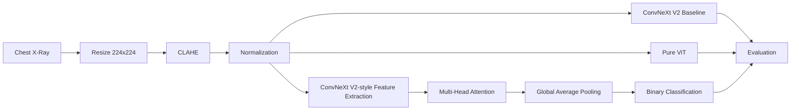

# 🫁 Pneumonia Detection from Chest X-Ray

A medical image classification project for detecting **pneumonia from chest X-ray images** using deep learning.

The project was developed and trained in **Google Colab** and compares:

- **ConvNeXt V2-style Baseline**
- **Pure Vision Transformer (ViT)**
- **Hybrid ConvNeXt V2-style + Multi-Head Attention**

The image pipeline applies **CLAHE preprocessing** and data augmentation before model training.

> ⚠️ **Research / educational use only.** This project is not a medical diagnostic device and must not be used as a substitute for professional clinical assessment.
[](https://colab.research.google.com/github/TienKoBjp/medical-ai-pneumonia-xray/blob/main/pneumonia_detection_github.ipynb)
## 🚀 Open in Google Colab

After uploading this repository to GitHub, you can add the Colab badge below:

```markdown
[](https://colab.research.google.com/github/TienKoBjp/medical-ai-pneumonia-xray/blob/main/pneumonia_detection_github.ipynb)
```


## 📌 Project Overview

### Objective

Build and compare deep learning models for binary classification of chest X-rays:

- `NORMAL`
- `PNEUMONIA`

### Main techniques

| Component | Implementation |
|---|---|
| Image preprocessing | OpenCV + CLAHE |
| Input size | 224 × 224 × 3 |
| Baseline | ConvNeXt V2-style |
| Transformer | Pure ViT |
| Proposed model | Hybrid ConvNeXt V2-style + Multi-Head Attention |
| Optimizer | AdamW |
| Evaluation | Accuracy, Precision, Recall, F1, ROC-AUC |
| Explainability | Grad-CAM investigation |
| Demo | Gradio |
| Environment | Google Colab / TensorFlow |

## 🧠 Architecture



## 📂 Repository Structure

```text
medical-ai-pneumonia-xray/
├── README.md
├── pneumonia_detection_github.ipynb
├── requirements.txt
├── .gitignore
├── LICENSE
└── assets/
    └── README.md
```

The dataset and trained model files are intentionally **not** included in the repository.

## 📊 Dataset

The project uses the public **Chest X-Ray Images (Pneumonia)** dataset by Paul Mooney on Kaggle.

The notebook downloads the dataset at runtime using the Kaggle API.

Expected structure:

```text
dataset/
└── chest_xray/
    ├── train/
    │   ├── NORMAL/
    │   └── PNEUMONIA/
    ├── val/
    │   ├── NORMAL/
    │   └── PNEUMONIA/
    └── test/
        ├── NORMAL/
        └── PNEUMONIA/
```

## 🔧 How to Run

### Option 1 — Google Colab

1. Upload this repository to GitHub.
2. Open `pneumonia_detection_github.ipynb`.
3. Click **Open in Colab**.
4. Upload your `kaggle.json` when prompted.
5. Run the notebook from top to bottom.
6. Training the three models can take significant GPU time.

### Option 2 — Local Jupyter

The notebook was designed primarily for Google Colab. Local execution requires the dependencies in `requirements.txt` and a compatible TensorFlow environment.

## 🔐 Security

Never commit:

- `kaggle.json`
- API keys
- passwords
- `.env` files
- trained checkpoints containing private data
- the raw medical dataset

GitHub recommends repository security features such as secret scanning and push protection for public repositories.

## 📈 Evaluation

The notebook calculates metrics from actual model predictions:

- Accuracy
- Precision
- Recall
- F1-score
- ROC curve
- AUC
- Confusion matrix

The ROC section uses the complete prediction scores rather than constructing a synthetic ROC curve from a single confusion-matrix operating point.

## 🔬 Experimental Results

The original project report contains the following reported comparison:

| Metric | ConvNeXt V2 Baseline | Pure ViT | Hybrid ConvNeXt V2–ViT |
|---|---:|---:|---:|
| Accuracy | 77.08% | 72.44% | 88.78% |
| Recall | 94.62% | 94.10% | 94.87% |
| Precision | 75.00% | 71.00% | 88.00% |
| F1-score | 84.00% | 81.00% | 91.00% |
| False Negatives | 21 | 23 | 20 |

**Important:** these values are the reported results from the original project. Re-running the cleaned notebook may produce different values because of random initialization, software versions, GPU/runtime differences, and training conditions. Do not present a rerun as the original experiment without verifying it.

## ⚠️ Limitations

This project is a student/research implementation, not a clinically validated system.

Important limitations include:

- Dataset demographic and clinical bias
- Limited external validation
- Possible distribution shift on other hospitals/devices/populations
- Need for more rigorous patient-level validation
- Need for calibrated probabilities
- Grad-CAM requires architecture-specific layer selection

## 🛠️ Future Work

- External validation on independent datasets
- Better patient-level splitting and leakage analysis
- Transfer learning from large medical-image models
- Model calibration
- More robust explainability
- Model versioning and experiment tracking
- Clinical validation before any real-world use

## 📚 Project Topics

`medical-imaging` · `pneumonia-detection` · `chest-xray` · `deep-learning` · `tensorflow` · `vision-transformer` · `convnext` · `clahe` · `grad-cam` · `explainable-ai` · `gradio`

## 📄 License

This repository is intended for educational and research purposes. See `LICENSE`.
